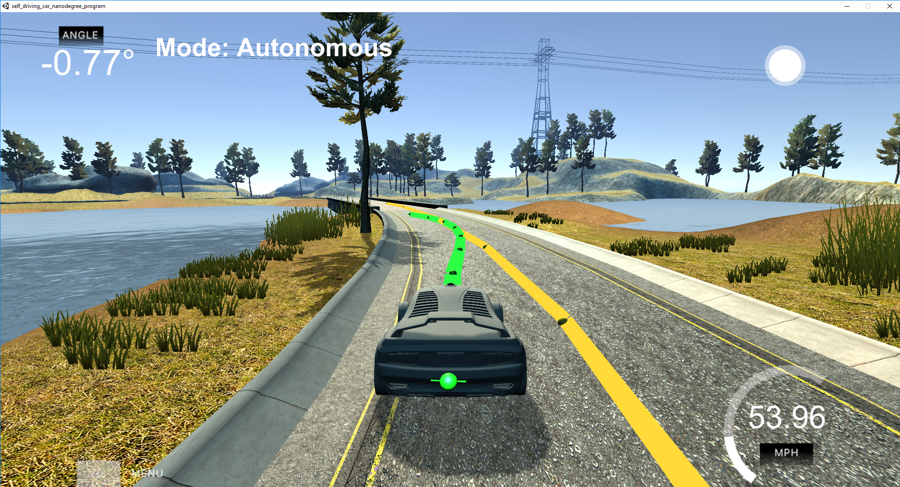

# CarND-Controls-MPC
#### Self-Driving Car Engineer Nanodegree Program
This repository contains realisation of Model-Predictive-Controller for
autonomous drive of Udacity open-source simulator. Target of this project
was to implement MPC that can safely go through the lake track (and also
to challenge it to make it fast).


## Rubric discussion

* Student describes their model in detail. This includes the state, actuators and update equations.

This project uses kinematic model. This means, that state is represented by
vehicle parameters such as position (x, y), heading (angle), velocity,
and location parameters, such as cross track error and angle error, computed
against "desired" driving line. It's different from dynamic model, as
it doesn't take into account parameters like vehicle mass, road slippery, traction and
treadwear, etc.
Actuator that are used by this model are throttle and steering value.
Kinematic model takes into account time delta to compute state in next timestamp
t+1 taking all parameters that depend on each other (like position x depends
on current x postion, current velocity and cosinus of vehicle angle):


Errors are also calculated based on previous errors, but also take vehicle
model into account (so we also predict error).


I've put weights on minimizing cte and epsi in state, and steering value in actuators.
One can have a feeling, that minizing errors is the most critical for MPC,
but it seems that minimizing actuators is most crucial. Even though the
optimizer can minimize errors really well it wouldn't make it, when it'd
catch harsh oscillations, as it couldn't compute and react to big oscillations
quickly enough to not "overdrive". As minimizing throttle isn't really that
necessary to drive the loop (it just looks not so good when car speeds up
and down), I've put the heaviest weight on steering value, as it enables
to drive smoothly and get rid of oscillations. It also gives a really interesting
feature, as car tries to minimize steering values, so when it predicts a turn, it actually
starts turning before hitting the turn - what gives something that's similar
to racing line.


* Student discusses the reasoning behind the chosen N (timestep length) and dt (elapsed duration between timesteps) values. Additionally the student details the previous values tried.

I've made only few experiments, as I couldn't see any better results by changing
timestep length and duration between frames.
I've tried lowering dt to 0.05, but it made MPC really unstable, as probably
difference was too small what led to bigger errors, and maybe to actuation before real situation.
I also haven't noticed better results with longer dt, so I left 0.1 as suggested by Udacity.
I tried longer timestamp, but when I saw that it causes longer predicted green line,
that was highly inaccurate in the longer timestamp(I tried N = 25 and 15). I've found that lowering it
will be better solution, as solver will have to make less computations. Especially as
I saw that first few points are getting close to desired line, so I ended up
with N = 8. It makes sense, as David said in lecture, there's no point to try to predict whole track,
as after .5 second situation is different, because our model is inaccurate,
and we rather need to react fast, then to predict everything on start.

* Polynomial Fitting and MPC Preprocessing

I've tried second order and third order polynomial. Finally I've chosen third order,
as it was faster converging with desired line, even though it sometimes
has very funny ending, that's very curved and that would create very high
error if trying to drive always the whole predicted path. I'm showing this on image below,
where it's visible that if we drive all points from green line we will get off the bridge,
and that cte starts growing at last points. But that's really good drive prediction,
as it actually converges desired line in 4th timestamp.



To ease computations I moved waypoints to vehicle space. To do so I computed
difference between waypoint position and vehicle position, and then
rotated calculated x and y values, to be aligned to vehicle x axis.

* Model Predictive Control with Latency

To handle latency I decided to compute my state as I would by in the future
after given latency (I used 100 ms as required by Udacity). So I computed
vehicle position, steering value and forecast errors after 100 ms by using
current model values (same principle as in update equations), and I pushed
it to optimizer as initial state, so it calculates optimal driving parameters
not for current situation, but for situation in 100ms. One thing I haven't
computed as in future was vehicle speed, as I don't know it dependency on
throttle (I haven't tested it to make estimated model), so vehicle speed
in 100ms future is treated as it would be the same as is now.

I've run safely my model with 55 mph, but I also noticed, that it depends
a little on my current PC load (I use notebook for this), so probably the code
could have few optimizations to speed up computing and have more spare
time for optimizer to compute equations solution.

------------------------------------------------------------------------------------------------------------------------------------------------------------------------

## Dependencies

* cmake >= 3.5
 * All OSes: [click here for installation instructions](https://cmake.org/install/)
* make >= 4.1(mac, linux), 3.81(Windows)
  * Linux: make is installed by default on most Linux distros
  * Mac: [install Xcode command line tools to get make](https://developer.apple.com/xcode/features/)
  * Windows: [Click here for installation instructions](http://gnuwin32.sourceforge.net/packages/make.htm)
* gcc/g++ >= 5.4
  * Linux: gcc / g++ is installed by default on most Linux distros
  * Mac: same deal as make - [install Xcode command line tools]((https://developer.apple.com/xcode/features/)
  * Windows: recommend using [MinGW](http://www.mingw.org/)
* [uWebSockets](https://github.com/uWebSockets/uWebSockets)
  * Run either `install-mac.sh` or `install-ubuntu.sh`.
  * If you install from source, checkout to commit `e94b6e1`, i.e.
    ```
    git clone https://github.com/uWebSockets/uWebSockets
    cd uWebSockets
    git checkout e94b6e1
    ```
    Some function signatures have changed in v0.14.x. See [this PR](https://github.com/udacity/CarND-MPC-Project/pull/3) for more details.

* **Ipopt and CppAD:** Please refer to [this document](https://github.com/udacity/CarND-MPC-Project/blob/master/install_Ipopt_CppAD.md) for installation instructions.
* [Eigen](http://eigen.tuxfamily.org/index.php?title=Main_Page). This is already part of the repo so you shouldn't have to worry about it.
* Simulator. You can download these from the [releases tab](https://github.com/udacity/self-driving-car-sim/releases).
* Not a dependency but read the [DATA.md](./DATA.md) for a description of the data sent back from the simulator.


## Basic Build Instructions

1. Clone this repo.
2. Make a build directory: `mkdir build && cd build`
3. Compile: `cmake .. && make`
4. Run it: `./mpc`.

## Tips

1. It's recommended to test the MPC on basic examples to see if your implementation behaves as desired. One possible example
is the vehicle starting offset of a straight line (reference). If the MPC implementation is correct, after some number of timesteps
(not too many) it should find and track the reference line.
2. The `lake_track_waypoints.csv` file has the waypoints of the lake track. You could use this to fit polynomials and points and see of how well your model tracks curve. NOTE: This file might be not completely in sync with the simulator so your solution should NOT depend on it.
3. For visualization this C++ [matplotlib wrapper](https://github.com/lava/matplotlib-cpp) could be helpful.)
4.  Tips for setting up your environment are available [here](https://classroom.udacity.com/nanodegrees/nd013/parts/40f38239-66b6-46ec-ae68-03afd8a601c8/modules/0949fca6-b379-42af-a919-ee50aa304e6a/lessons/f758c44c-5e40-4e01-93b5-1a82aa4e044f/concepts/23d376c7-0195-4276-bdf0-e02f1f3c665d)
5. **VM Latency:** Some students have reported differences in behavior using VM's ostensibly a result of latency.  Please let us know if issues arise as a result of a VM environment.

## Editor Settings

We've purposefully kept editor configuration files out of this repo in order to
keep it as simple and environment agnostic as possible. However, we recommend
using the following settings:

* indent using spaces
* set tab width to 2 spaces (keeps the matrices in source code aligned)

## Code Style

Please (do your best to) stick to [Google's C++ style guide](https://google.github.io/styleguide/cppguide.html).

## Project Instructions and Rubric

Note: regardless of the changes you make, your project must be buildable using
cmake and make!

More information is only accessible by people who are already enrolled in Term 2
of CarND. If you are enrolled, see [the project page](https://classroom.udacity.com/nanodegrees/nd013/parts/40f38239-66b6-46ec-ae68-03afd8a601c8/modules/f1820894-8322-4bb3-81aa-b26b3c6dcbaf/lessons/b1ff3be0-c904-438e-aad3-2b5379f0e0c3/concepts/1a2255a0-e23c-44cf-8d41-39b8a3c8264a)
for instructions and the project rubric.

## Hints!

* You don't have to follow this directory structure, but if you do, your work
  will span all of the .cpp files here. Keep an eye out for TODOs.

## Call for IDE Profiles Pull Requests

Help your fellow students!

We decided to create Makefiles with cmake to keep this project as platform
agnostic as possible. Similarly, we omitted IDE profiles in order to we ensure
that students don't feel pressured to use one IDE or another.

However! I'd love to help people get up and running with their IDEs of choice.
If you've created a profile for an IDE that you think other students would
appreciate, we'd love to have you add the requisite profile files and
instructions to ide_profiles/. For example if you wanted to add a VS Code
profile, you'd add:

* /ide_profiles/vscode/.vscode
* /ide_profiles/vscode/README.md

The README should explain what the profile does, how to take advantage of it,
and how to install it.

Frankly, I've never been involved in a project with multiple IDE profiles
before. I believe the best way to handle this would be to keep them out of the
repo root to avoid clutter. My expectation is that most profiles will include
instructions to copy files to a new location to get picked up by the IDE, but
that's just a guess.

One last note here: regardless of the IDE used, every submitted project must
still be compilable with cmake and make./

## How to write a README
A well written README file can enhance your project and portfolio.  Develop your abilities to create professional README files by completing [this free course](https://www.udacity.com/course/writing-readmes--ud777).
